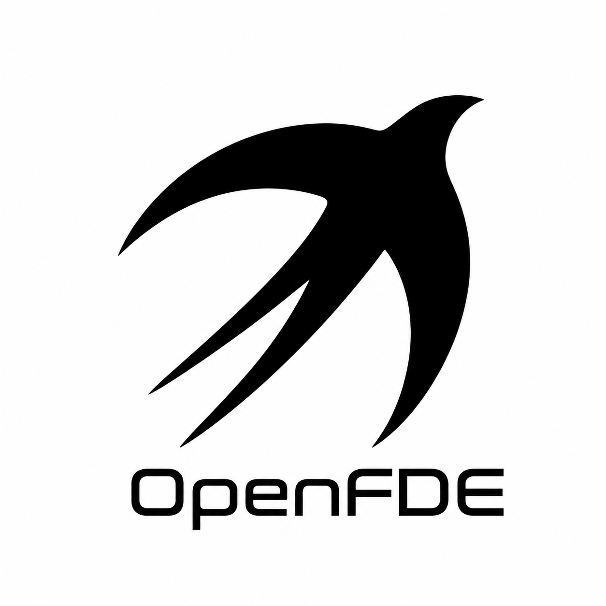

# OpenFDE

**Nest on the customer's site, and turn frontier models into production systems.**

Open knowledge base & tooling for **Forward Deployed Engineers (FDE)** · EST. 2026

[🌐 open-fde.com](https://open-fde.com)

**English** · [简体中文](./README.zh-CN.md)

---

## What this is

**FDE is the pivotal role for landing AI inside the enterprise.** Frontier models get stronger every month, but the speed at which companies wire them into core workflows lags far behind — and the people closing that gap are FDEs. Yet the first-hand material on the role is scattered across job pages, blogs, podcasts, and tweets; there is no systematic, neutral, source-traceable body of knowledge.

**OpenFDE aims to fix that:** we retrieve, de-duplicate, and structure the scattered first-hand signals into reusable knowledge, and we go further by open-sourcing the **AI-native tools** an FDE needs across the full lifecycle — because in the AI era, an FDE has to be an AI-native team/organization.

The swift is our mark: it spends almost its whole life in flight, yet it "nests" on the customer's site — landing systems for real, staying long-term, and continually bringing signals back from the front line.

## Contents

| | |
|---|---|
| 📖 **The FDE Handbook** | A chaptered handbook from "what is an FDE" to role value, org & business models, tech stack, and interview prep |
| 🧭 **Competency Model · Role Map · Transition Paths** | The 3C competency framework, plus concrete paths into FDE from consulting / engineering / sales / pre-sales / PM / CSM / product roles |
| 🗺️ **The FDE Tooling Map** | Framed as "AI-native FDE team = small human core + fleet of agents," covering the full lifecycle market → contract → design → build → launch → operate, including the productization base, the model fleet, and AI hardware selection |
| 📚 **Reference Library** | First-hand material tiered by credibility: **1,550 retrieved → 1,251 de-duplicated → 663 verified** ("verified" = actually opened, or an authoritative spec link; never fabricated to pad the count) |
| 🧱 **Open-source FDE tools** (in progress) | Fork / adapt the ⭐ must-have agent tools from the map into FDE-specific ones |
| 🤖 **FDE Agent · FDE Loop** | An executable agent runtime for the enterprise site: `OBSERVE → ELICIT → INDUCE → ACT → EVOLVE` + DEPLOY / ATTRIBUTION. Connect MCP, Feishu, Slack, CRM, and databases with approval gates, audit trails, and reusable skills. See **[Open-FDE/FDEAgent](https://github.com/Open-FDE/FDEAgent)**. |

> Full content at **[open-fde.com](https://open-fde.com)**.

## Why the AI era

Palantir's moat isn't a single tool — it's the productization platform underneath, which sinks 50%+ of its investment into building its own product so every on-site delivery compounds into reusable product rather than a one-off project. OpenFDE argues that **an FDE team in the AI era must do the same**: use the best agentic tools and models to amplify output, feed on-site needs back into your own product, and survive on product compounding rather than throwing bodies at the problem.

## Contributing

Whether you're an FDE, want to become one, or are building an FDE team — you're welcome to take part: add first-hand material, revise the handbook, contribute tools, or fix errors. Just open an Issue or PR.

## On independence

OpenFDE has **no affiliation with or endorsement from** OpenAI, Palantir, Anthropic, Google, ByteDance, or others; trademarks belong to their respective owners.

## License

- **Documentation content**: [CC BY-SA 4.0](https://creativecommons.org/licenses/by-sa/4.0/) (attribution + share-alike)
- **Site & tooling code**: [MIT](./LICENSE)
